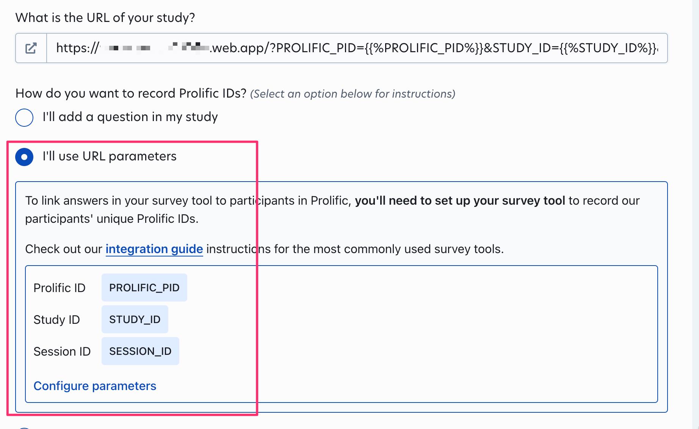

# Possibility Generation and Force Study jsPsych + Firestore implementation (jsPsych-Firebase-Firestore-Prolific-Vite)

This is a study designed using [Dae's](https://github.com/daeh/) [serverless jsPsych template](https://github.com/daeh/jspsych-template).

## Installation

- Fork this repo: `Use this template` > `Create a new repository`
- Git clone the forked repo (replace with your repo info): e.g. `git clone --branch main https://github.com/echecht/jspsych-template jspsych-template`
- Enter the repo folder (replace with your repo info): e.g. `cd jspsych-template`

### Firebase configuration

After you setup your Firebase and Firestore services, add your configurations to

- [`.firebaserc`](.firebaserc)
- [`firebaseConfig.ts`](hosting/src/firebaseConfig.ts)

### Install Node dependancies

Install the dependancies using [npm](https://www.npmjs.com/) or [Yarn](https://yarnpkg.com/), e.g.

```shell
###
### From within the cloned repo folder
###

### Install the Firebase dependencies
npm install

### Push the Firestore rules (defined in firestore.rules)
npm run deploy-rules

### Enter the experiment directory
cd "hosting" || exit

### Install the website dependencies
npm install

### Start the Vite server
npm run dev
```

In addition to installing the dependancies, this will create the `eslint.config.js` link to `eslint.config.mjs` (see [Components](#components)).


# Configuration

## ESLint

This project uses a future-looking configuration that implements the major developments from [ESLint](https://eslint.org).

### ESLint Flat Config System

Beginning in ESLint `v9.0.0`, the default will be the new [flat config system](https://eslint.org/docs/latest/use/configure/configuration-files-new). This will depreciate the `Common.js Module` config system (which uses `.eslintrc.js`), replacing it with the `ES Module` config system (which uses `eslint.config.js`).

### ESLint Stylistic

ESLint is [depreciating formatting rules](https://eslint.org/blog/2023/10/deprecating-formatting-rules/), passing over maintenance and development to the community-run plugin [ESLint Stylistic](https://eslint.style/).

## Components

The main config file in this repo is the flat ESLint config, [`eslint.config.mjs`](hosting/eslint.config.mjs). This project is configured as a `ES Module`, so this file could be named `eslint.config.js`, but I have given it the `.mjs` extension to make this config work for `Common.js Module` development with minimal reconfiguration.

While ESLint has no issue using the `.mjs` config file, IDEs like VS Code and IntelliJ IDEA currently require the `.js` extension. A simple workaround is to make an alias `eslint.config.js` that points to `eslint.config.mjs`. This is done automatically during install by the [`hosting/package.json`](hosting/package.json) file.


For developing the website, this project uses

- [ESLint](https://eslint.org/) (configured in [`eslint.config.mjs`](hosting/eslint.config.mjs))
- [Typescript](https://www.typescriptlang.org/) (configured in [`tsconfig.*.json`](hosting/tsconfig.base.json))
- [Prettier](https://prettier.io/) (configured in [`.prettierrc.json`](hosting/.prettierrc.json))

The ESLint config integrates these configurations.


For bundling the website, this project uses

- [Vite](https://vitejs.dev/) (configured in  [`vite.config.ts`](hosting/vite.config.ts))
- [Tailwind CSS](https://tailwindcss.com/) (configured in [`tailwind.config.ts`](hosting/tailwind.config.ts))
- [PostCSS](https://postcss.org/) (configured in [`postcss.config.js`](hosting/postcss.config.js); uses [Autoprefixer](https://github.com/postcss/autoprefixer))
- [Browserslist](https://github.com/browserslist/browserslist) (via the [browserslist-to-esbuild plugin](https://github.com/marcofugaro/browserslist-to-esbuild); configured in [`hosting/package.json`](hosting/package.json))


- [jsPsych](https://www.jspsych.org/) - UX (experiment flow, data capture)
- [Firebase](https://firebase.google.com/) - hosting (configured by files in project root)
- [Firestore](https://firebase.google.com/docs/firestore) - [Serverless](https://www.serverless.com/) data storage/access (configured by files in project root)


- [Prolific](https://www.prolific.com/)


### Firestore Configuration


### Prolific Configuration




## IDE

### VS Code Settings

For [VS Code](https://code.visualstudio.com/) to respect the configuration, you need to specify the formatter for the relevant files. This is done for you in [`hosting.code-workspace`](hosting.code-workspace) and in [`hosting/.vscode/settings.json`](hosting/.vscode/settings.json) (you only need one of these but should be ok to have both). This configures VS Code to use the ESLint flat config system, and to use Prettier, to lint and format JavaScript, HTML, JSON, and CSS files. This obviously requires the [ESLint](https://marketplace.visualstudio.com/items?itemName=dbaeumer.vscode-eslint) and [Prettier - Code Formatter](https://marketplace.visualstudio.com/items?itemName=esbenp.prettier-vscode) extensions to be enabled for the workspace. You should also install and enable the [Tailwind CSS IntelliSense](https://marketplace.visualstudio.com/items?itemName=bradlc.vscode-tailwindcss) extension for the workspace.

```json
{
  "editor.formatOnSave": true,
  "editor.codeActionsOnSave": {
    "source.fixAll.eslint": true
  },
  "eslint.experimental.useFlatConfig": true,
  "[javascript][javascriptreact][typescript]": {
    "editor.defaultFormatter": "esbenp.prettier-vscode"
  },
  "[html]": {
    "editor.defaultFormatter": "esbenp.prettier-vscode"
  },
  "[json][jsonc]": {
    "editor.defaultFormatter": "esbenp.prettier-vscode"
  },
  "[css][scss][less]": {
    "editor.defaultFormatter": "esbenp.prettier-vscode"
  }
}
```


### IntelliJ IDEA Settings

This project should work out of the box for [IntelliJ IDEA](https://www.jetbrains.com/idea/) / [WebStorm](https://www.jetbrains.com/webstorm/) (once the `eslint.config.js` file has been created). Make sure you have enabled ESLint and Prettier for the project:

- `Settings... > Languages & Frameworks > JavaScript > Code Quality Tools > ESLint`
  - Enable `Automatic ESLint configuration`
  - Enable `Run eslint --fix on save`
- `Settings... > Languages & Frameworks > JavaScript > Prettier`
  - Enable `Automatic Prettier configuration`
  - Enable `Run on save`

If you change the project from an `ES Module` to a `Common.js Module`, or if ESLint isn't working, try [this fix from Ditlef Diseth](https://youtrack.jetbrains.com/issue/WEB-61117/ESLint-flat-config-doesnt-work-with-non-default-custom-path-to-the-config-file#focus=Comments-27-8196242.0-0).

## Usage

You can format, lint and build the project from the command line by calling the commands in [`hosting/package.json`](hosting/package.json):

```json
{
  "scripts": {
    "dev": "vite",
    "build": "tsc --project tsconfig.json --noEmit && vite build",
    "build-dev": "tsc --project tsconfig.dev.json --noEmit && vite build",
    "build-prod": "tsc --project tsconfig.prod.json --noEmit && vite build",
    "lint": "ESLINT_USE_FLAT_CONFIG=true prettier --write . && eslint --config eslint.config.mjs --fix .",
  }
}
```

To develop the website, running `npm run dev` will open a localhost Vite server that will update as you made modifications.


### Sandbox

When developing the experiment, you can set `const sandy = true` in [`globals.ts`](hosting/src/globals.ts). This will increase the verbosity of the console output. 


---


